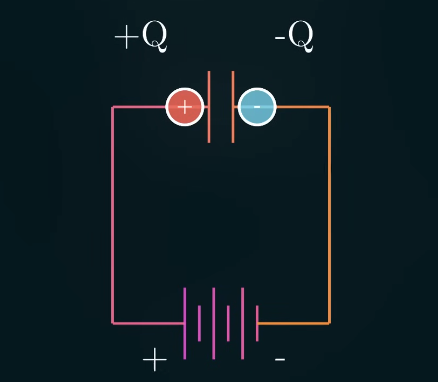
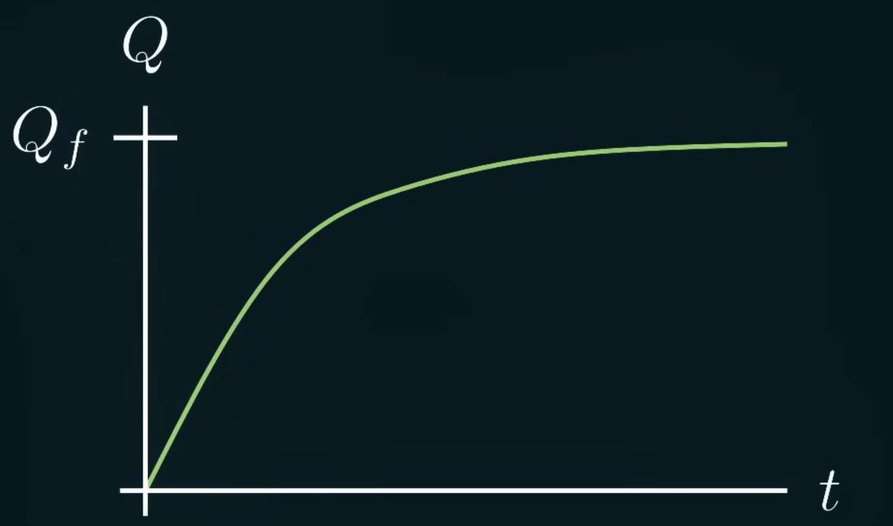
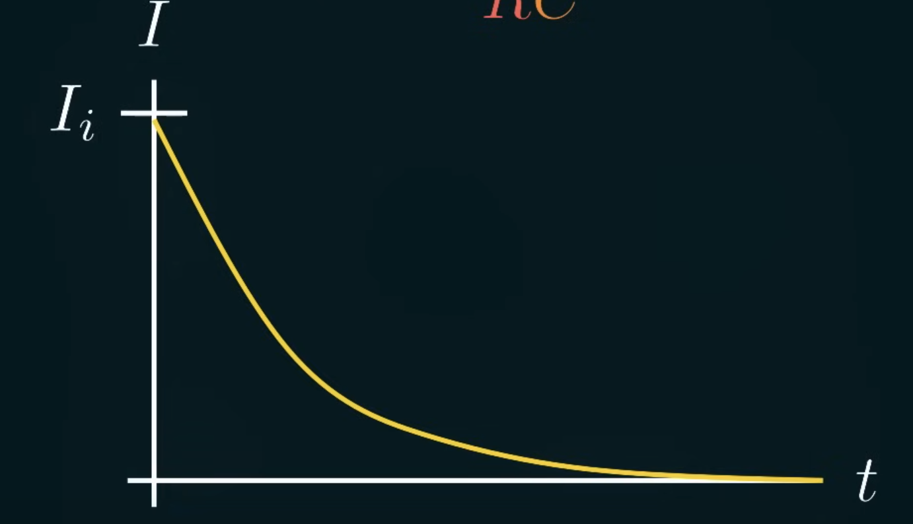
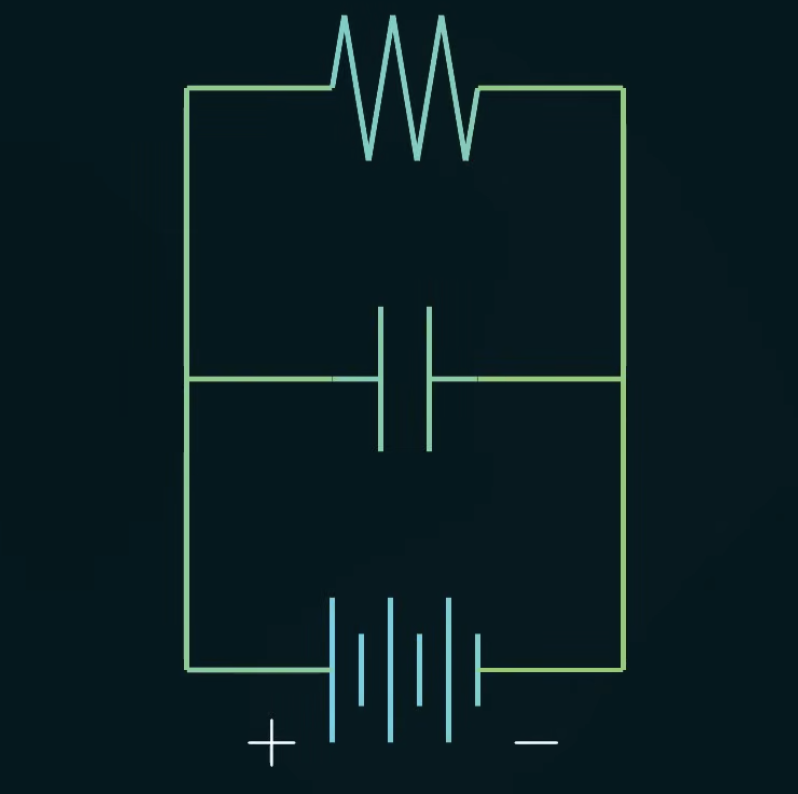
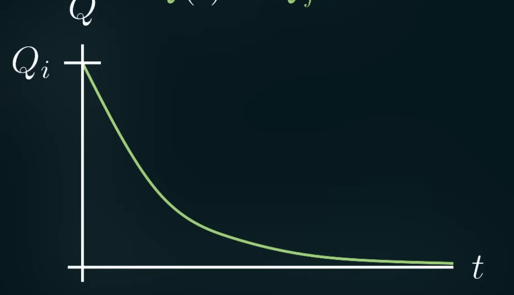

Capacitor is basically just 2 connected metal plates separated from each other.

If we put it across a voltage source, the charges will flow the sheet since they're attracted to the other side. When the charges reached the sheet, the charges on the opposite sheet will get repelled by the charges on this sheet. Those repelled charges continue on the same path. Now there's more positive charges on 1 side and more negative charges on the other.

Overtime, the capacitor will reach an equilibrium when it has a voltage across the plates that directly opposes the voltage created by the battery.

We can calculate capacitance by calculating the charge on the plate when you apply some voltage.

$$
C = \frac{Q}{V}
$$

If we want to know exactly how much capacitance will be on the capacitor over time then we can break it down using the Kirchhoff's loop rule.

So we get this equation from the Kirchhoff's loop rule:

$$
\begin{align}
C = \frac{Q}{V_c} \rightarrow V_c = \frac{Q}{C}
\\
V - \frac{Q}{C} - IR = 0
\end{align}
$$

We get that the voltage form the battery minus the voltage from the capacitor minus the voltage drop across the resistor must be equal to 0. Since the current is change in charge over change in time, we can rewrite the equation as a differential equation:

$$
V - \frac{Q}{C} - \frac{dQ}{dt}R = 0
$$

Solving it gives us this exponential decay (carrying capacity) function:

$$
Q(t) = Q_f[1-e^{\frac{-t}{RC}}]
$$

At the beginning, the charge accumulates very quickly, then it levels off over time as the capacitor is fully charged. We can also look at the current, which is the slope of the charge curve.

$$
I(t) = \frac{Q_f}{RC} e^{\frac{-t}{RC}}
$$

At the beginning, a lot of charges is flowing through the capacitor, then it goes to 0 over time because the capacitor is opposing the voltage from the battery.

This circuit is made to account for voltage fluctuation.

When the battery's on, at first, the current goes through the capacitor, charging it up. Once the capacitor is fully charged, the voltage source's current will divert, going to the rest of the circuit. If the voltage source somehow goes out, the current will continue to go from the capacitor to the rest of the circuit. We can model the decay with the exponential decay equation:

$$
Q(t) = Q_f e^{\frac{-t}{RC}}
$$

The capacitor starts with a lot of charges and quickly gets rid of it through the resistor.

Generally, the capacitor works kinda like an open wire at the beginning, allowing current flow when it's charging up its plates. Over time, as it gets more charged up, it will turn into an open circuit, opposing voltage applied across it.