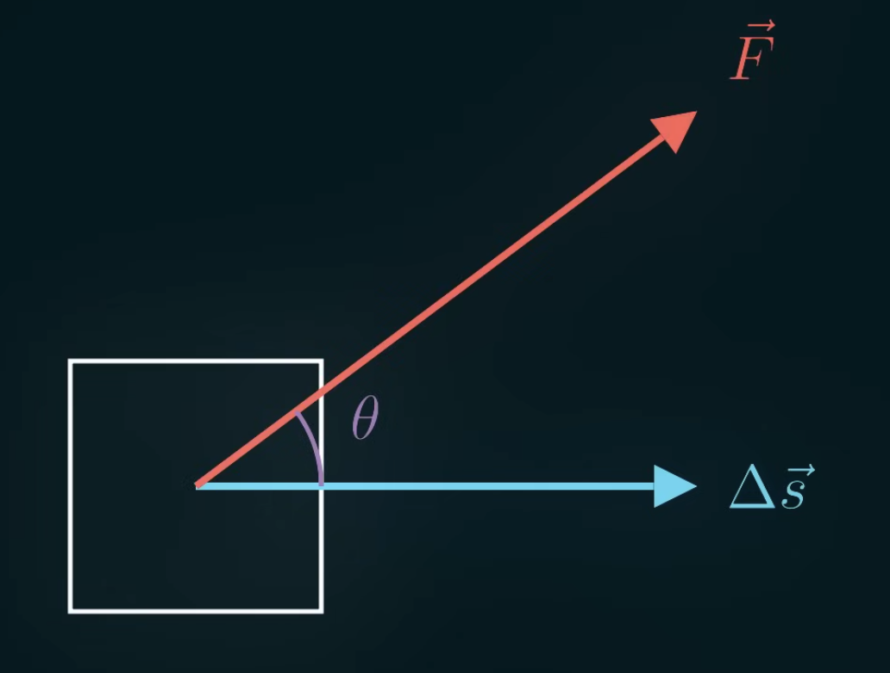

Take a square object for example. *Work* ($W$) describes the alignment of force ($\vec{F}$) and displacement ($\Delta \vec{s}$) of an object.

$$
W = F \Delta s \cos(\theta)
$$

Treating the displacement as gravity for example, the force of gravity is always pointing downwards. When we move an object against the force of gravity (holding it up, displacing it upwards but the force is downwards), we've created potential energy (because the object now has the potential to move downwards, following the flow of gravity).

So when we do negative work, we get potential energy:

$$
\begin{align}
U = -F \Delta s \cos(\theta)
\\
U = - \vec{F} \cdot \vec{\Delta s}
\end{align}
$$

If the force changes as we move along the path, we can integrate the potential energy:

$$
U = - \int{\vec{F} \cdot d\vec{s}}
$$

For the electric potential energy, we can put force to be the electric force equation and the change in distance to be the change in the $\hat{r}$ direction (radius direction, $dr\hat{r}$). We can start with the 2 charges infinitely far away from each other (if they're infinitely far away, they won't exert any forces on each other, meaning no potential energy), then we'll being them in to some radius $r'$.

$$
\begin{align}
\vec{F} = \frac{kq_1q_2}{r^2} \hat{r}
\\
d\vec{s} = dr \hat{r}
\\
U = - \int{\frac{kq_1q_2}{r^2} \hat{r} \cdot dr \hat{r}}
\end{align}
$$

Solving for the radius $r'$ equation:

$$
\begin{align}
U = - \int^{r'}_{\infty}{\frac{kq_1q_2}{r^2} \hat{r} \cdot dr \hat{r}}
\\
U = - \int^{r'}_{\infty}{\frac{kq_1q_2}{r^2} dr}
\\
U = \frac{kq_1q_2}{r^2} \biggr\rvert^{r'}_{\infty}
\\
U = \frac{kq_1q_2}{r'}
\end{align}
$$

This describe the potential energy between 2 charges of $r'$ radius.

Voltage is basically *potential energy* per unit of charge at some location.

$$
V = \frac{U}{q} = \frac{kq}{r}
$$

If electric field helps us figure out what force we'd get if we put a $+1$ charge here, voltage helps us figure out the potential energy of that $+1$ charge.