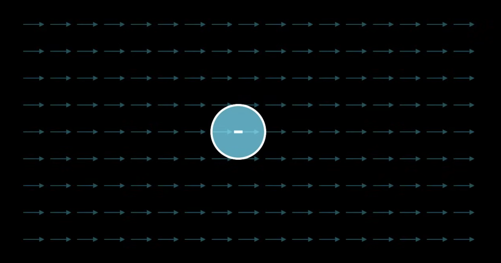
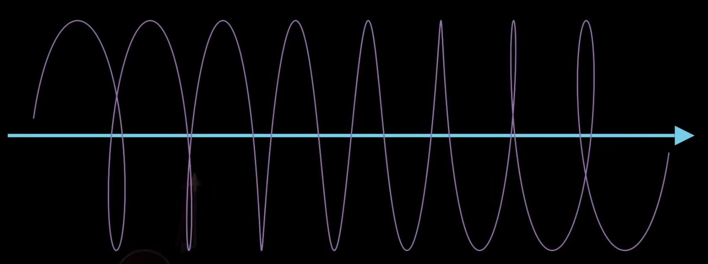

Magnetic fields also move charges. Specifically, the force on a charge from a magnetic field is equal to this:

$$
\vec{F} = q\vec{v} \times \vec{B}
$$

This means if a particle is not moving or has no velocity ( $\vec{v} = 0$, $\vec{0} = q\vec{0} \times \vec{B}$ ) then there's no magnetic force or the particle is moving parallel to the magnetic field ( $0 = qvB \sin(0)$ ). Once the particle starts moving slightly perpendicular to the magnetic field, the charge experiences a force that's both perpendicular to its velocity and the magnetic field, specifically with the cross product.

This means if a particle is not moving or has no velocity ($\vec{v} = 0$, $\vec{0} = q\vec{0} \times \vec{B}$) then there's no magnetic force or the particle is moving parallel to the magnetic field ($0 = qvB \sin(0)$). Once the particle starts moving slightly perpendicular to the magnetic field, the charge experiences a force that's both perpendicular to its velocity and the magnetic field, specifically with the cross product.

New right hand rule time. This right hand rule has us using 3 fingers, middle finger, index finger, and thumb. The middle finger points in the magnetic field vector, the thumb points in the force vector, and the index finger points in the current vector.

If we have an electron and a magnetic field pointing to the right, which direction would the force vector be pointing to?

Applying the right hand rule, the middle finger points to the magnetic field direction, meaning the thumb will show us the force will point upwards. However, since the charge $q$ of electrons are negative, the force will actually be inverted, pointing downwards.

$$
\vec{F} = q \vec{v} \times \vec{B}
$$

If we have a straight magnetic field and a charge, that charge will circle the the magnetic field. In 3D space, most charges will actually follow a helical path along the magnetic field.

*Side note*: This is how the northern lights work. Charges in the atmosphere get curled into a helical path because of the Earth's magnetic field. These accelerating charges create light waves.