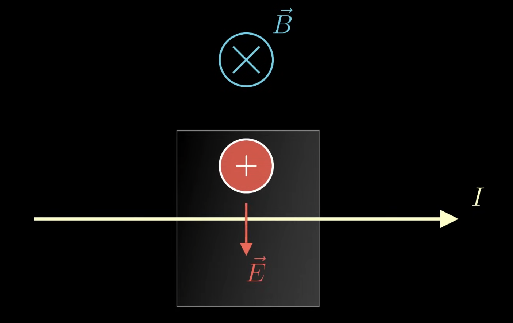
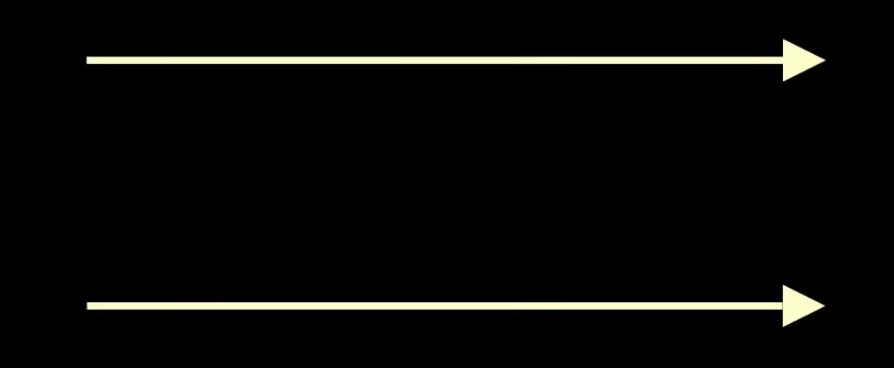

Magnetic fields also move charges. Specifically, the force on a charge from a magnetic field is equal to this:

$$
\vec{F} = q\vec{v} \times \vec{B}
$$

This means if a particle is not moving or has no velocity ( $\vec{v} = 0$, $\vec{0} = q\vec{0} \times \vec{B}$ ) then there's no magnetic force or the particle is moving parallel to the magnetic field ( $0 = qvB \sin(0)$ ). Once the particle starts moving slightly perpendicular to the magnetic field, the charge experiences a force that's both perpendicular to its velocity and the magnetic field, specifically with the cross product.

New right hand rule time. This right hand rule has us using 3 fingers, middle finger, index finger, and thumb. The middle finger points in the magnetic field vector, the thumb points in the force vector, and the index finger points in the current vector.

If we have an electron and a magnetic field pointing to the right, which direction would the force vector be pointing to?

Applying the right hand rule, the middle finger points to the magnetic field direction, meaning the thumb will show us the force will point upwards. However, since the charge $q$ of electrons are negative, the force will actually be inverted, pointing downwards.

$$
\vec{F} = q \vec{v} \times \vec{B}
$$

If we have a straight magnetic field and a charge, that charge will circle the the magnetic field. In 3D space, most charges will actually follow a helical path along the magnetic field.

*Side note*: This is how the northern lights work. Charges in the atmosphere get curled into a helical path because of the Earth's magnetic field. These accelerating charges create light waves.

If we have a wire of charges, we'll need to take the charge inside the wire. 

$$
\vec{F} = Q_{total} \vec{v} \times \vec{B}
$$

We know we can get the charge inside a wire with this:

$$
Q = (nq)Al
$$

Plugging this into the other equation:

$$
\vec{F} = nqAl \vec{v} \times \vec{B} = nqAv \vec{l} \times \vec{B}
$$

If we let the length vector point in the same direction as velocity, we can swap them since the magnitude and the direction are both preserved. So we get the current times the length vector:

$$
\vec{F} = I \vec{l} \times \vec{B}
$$

If the magnetic field changes across the wire, we can just add up the force across the wire using integrals:

$$
\vec{F} = \int{I d \vec{l} \times \vec{B}}
$$

So the magnetic force acting on a wire of current equals to adding up the current times the differential length cross with the magnetic field across the whole wire.

Now what about measuring magnetic field in real life. What we can do is position the magnetic field perpendicular to the current. The positive charges will be pushed upward. As more positive charges start to accumulate at the top, they create an electric field that opposes the magnetic field force until they're equal. Once they're equal, we know that the magnetic field force is equal and opposite to the force from the electric field. Since the current and magnetic field are perpendicular, this simplifies to just $qvB$ since $\sin(90\degree) = 1$. 

$$
\begin{align}
qE = q\vec{v} \times \vec{B}
\\
qE = qvB \sin(\theta)
\\
qE = qvB
\\
E = vB
\end{align}
$$

So the electric field is equal to the velocity times magnetic field. We also know that voltage is the accumulation of the electric field. Assuming the electric field is constant, we get this:

$$
\begin{align}
V = - \oint{\vec{E} \cdot d\vec{l}}
\\
V = - El
\end{align}
$$

Plugging this into the other equation, we get this magnetic field equation based on voltage, length and velocity:

$$
\begin{align}
- \frac{V}{l} = vB
\\
- \frac{V}{vl} = B
\end{align}
$$

For parallel wires like this:

The bottom wire will creates a curling magnetic field that points out of the screen. So using the right hand rule, the top wire will be pulled downwards into the bottom wire. Likewise, the top wire creates a curling magnetic field that points into the screen. So using the right hand rule, the bottom wire will be pulled upwards into the top wire.

